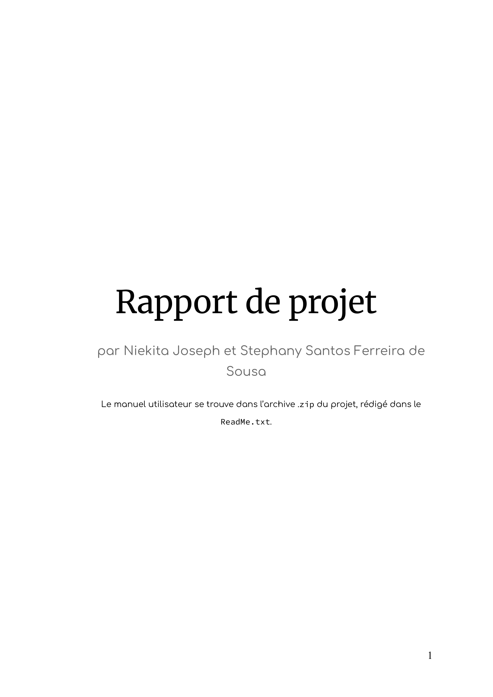
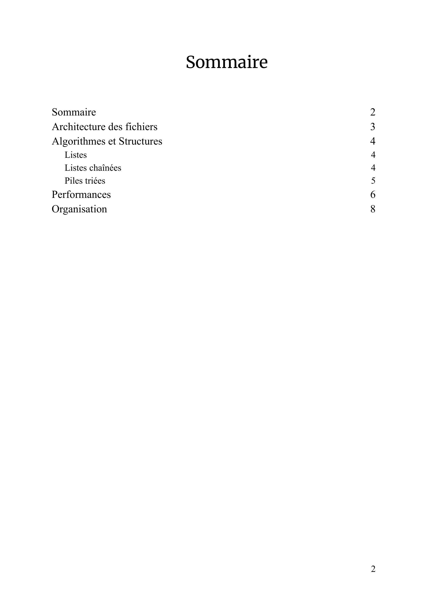
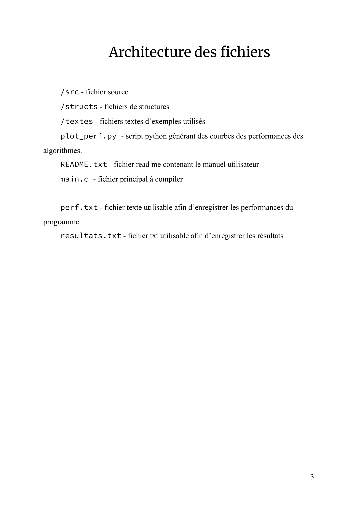
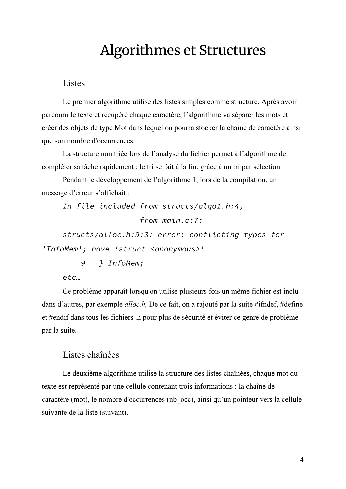
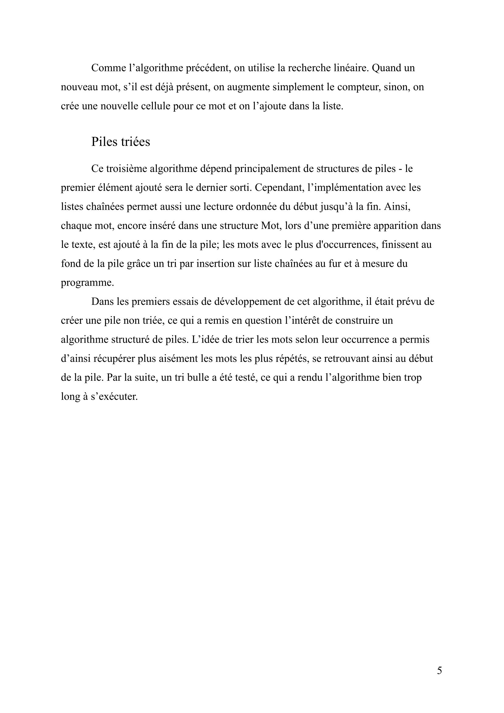
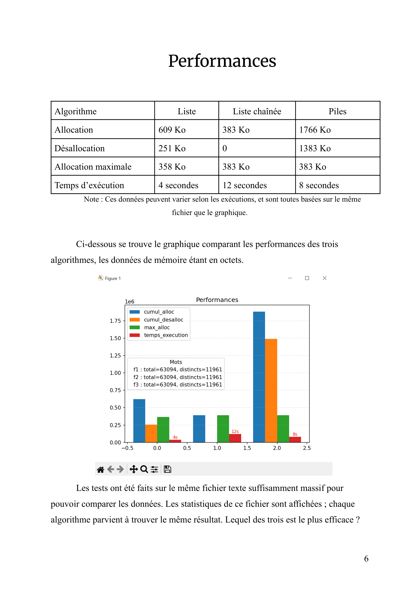
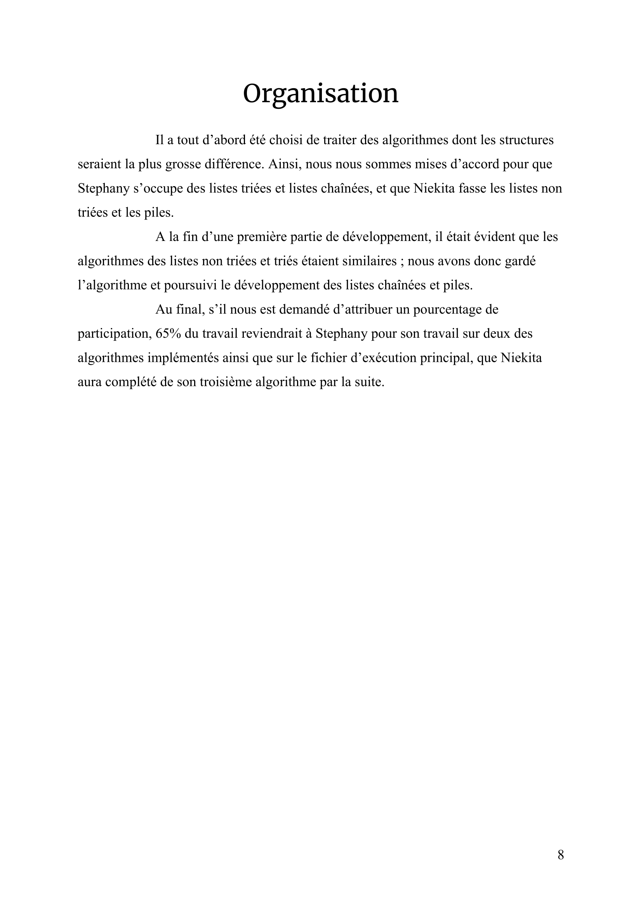

# Projet-C
Par Stephany Santos Ferreira de Sousa et Niekita Joseph

# Manuel utilisateur
Afin de compiler le projet, il vous suffit d'exécuter :
`gcc -Istructs main.c src\alloc.c src\outils.c src\algo1.c src\algo2.c src\algo3.c src\options.c src\mots_interdits.c -o projet`

Pour exécuter le projet, vous avez le choix :
- Un certain nombres de mots à afficher (-n)
- (bonus) Un nombre minimum de caractères pour les mots à afficher (-k)
- Entre 3 algorithmes différents (-a)
- Un affichage en console ou dans des fichiers choisis (-s fichier de résultat, -l fichier de performances)
- *Un ou plusieurs textes
  
Vous pourrez donc exécuter, par example :
`./projet -n 10 -k 10 -a algo1|algo2|algo3 -s fichier -l fichier textes`

Ou alors, avec les fichiers fournis dans notre archive de fichier:
`./projet -n 10 -k 10 -a algo1 -s input\resultat.txt -l input\perf.txt textes\les-fleurs-du-mal.txt`

Le programme lancé, vous aurez le choix d'entrer un nombre illimités de mots à exclure du calcul du nombre d'occurences. 
Lorsqu'il vous sera demandé, entrez ces mots, ent tapant sur la touche Entrer entre chaques, et finissez par `\fin`.

Afin d'exécuter le fichier de performances, il suffit de taper :
`python3 plot_perf.py input\perf_algo1.txt input\perf_algo2.txt input\perf_algo3.txt`

# Rapport de projet 
Explique le projet, son contenu et ses algorithmes, ainsi que l'étude comparative des différents algorithmes.

